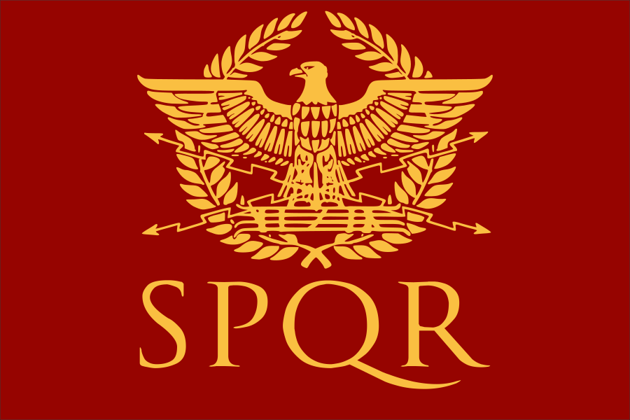
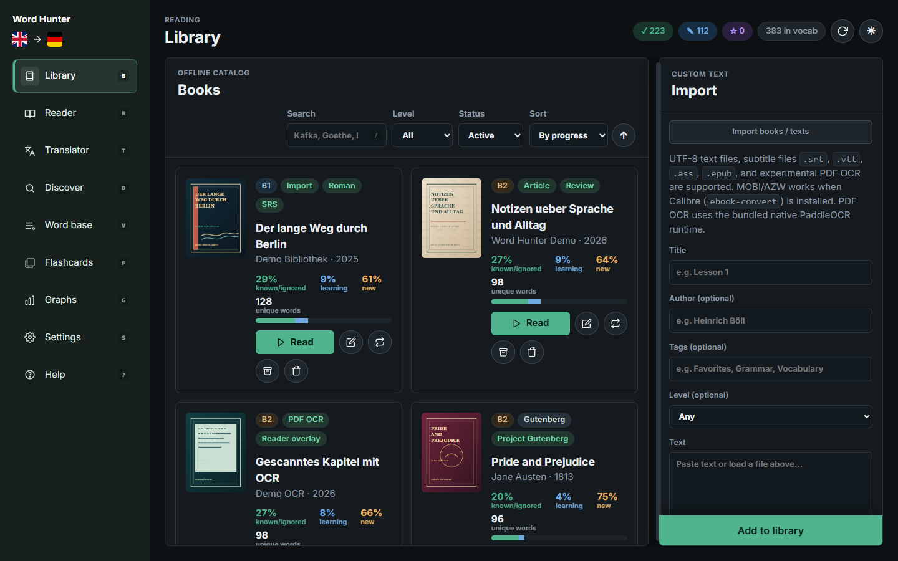
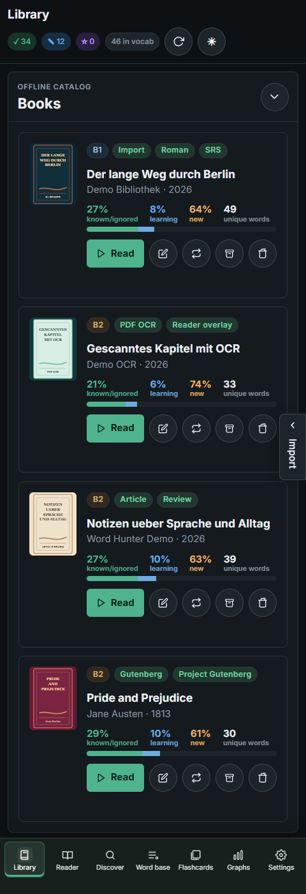
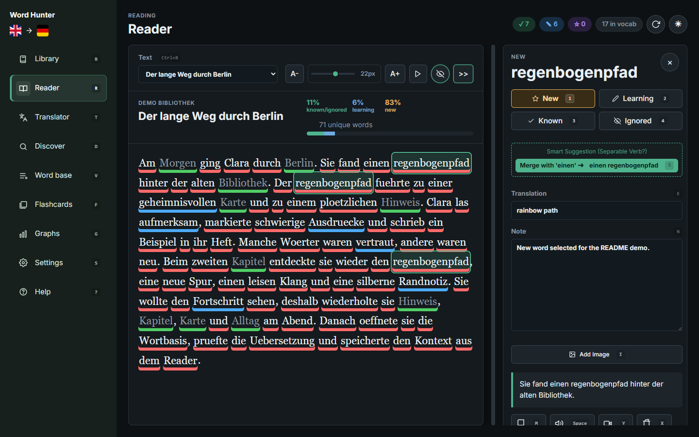
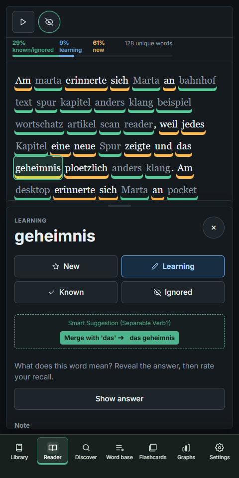
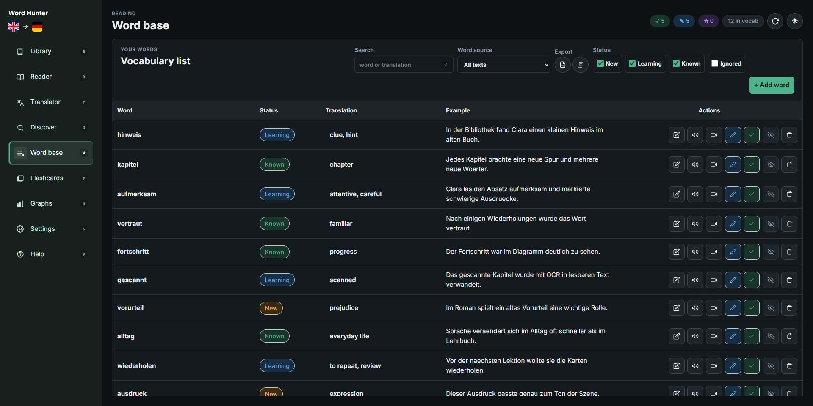
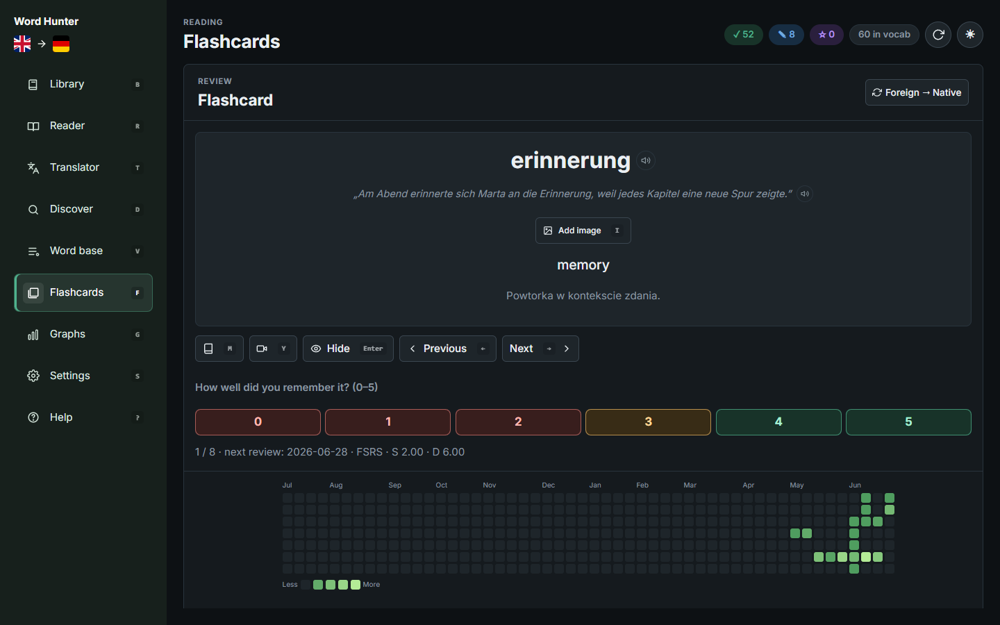
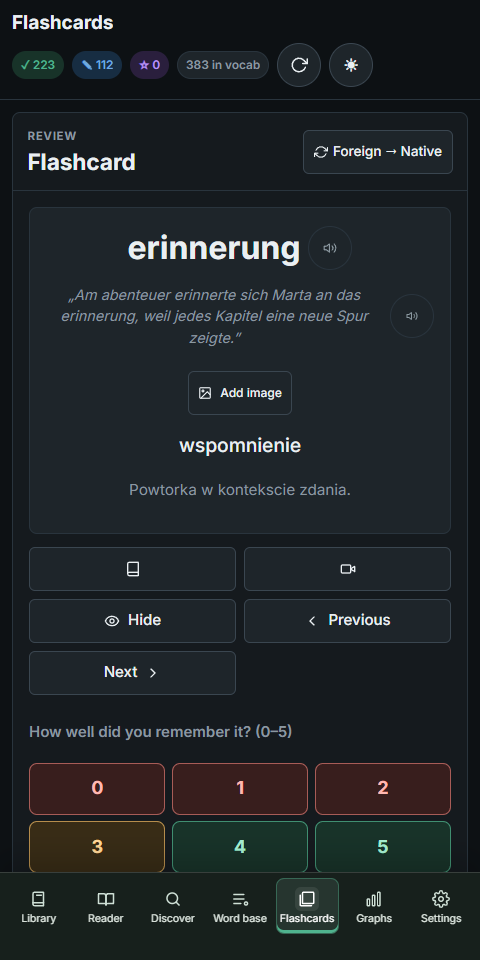
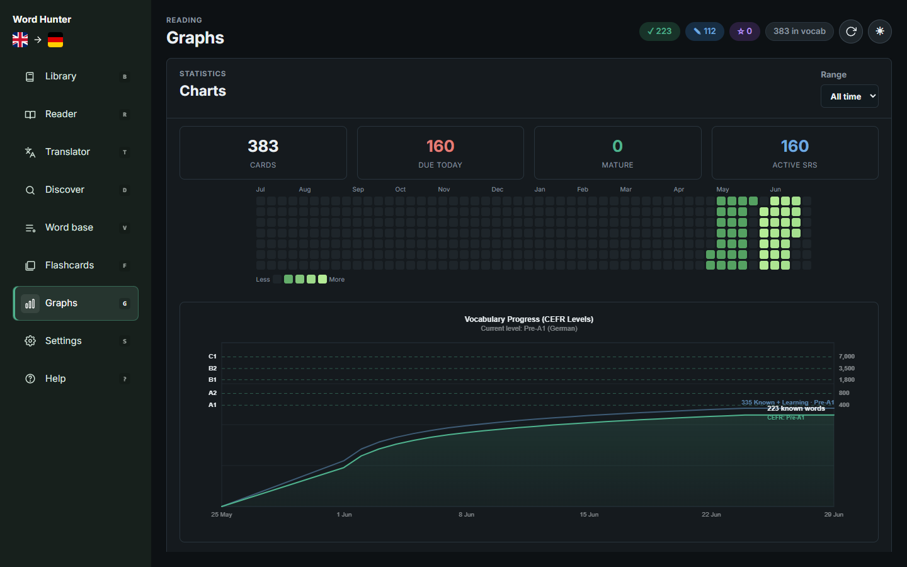
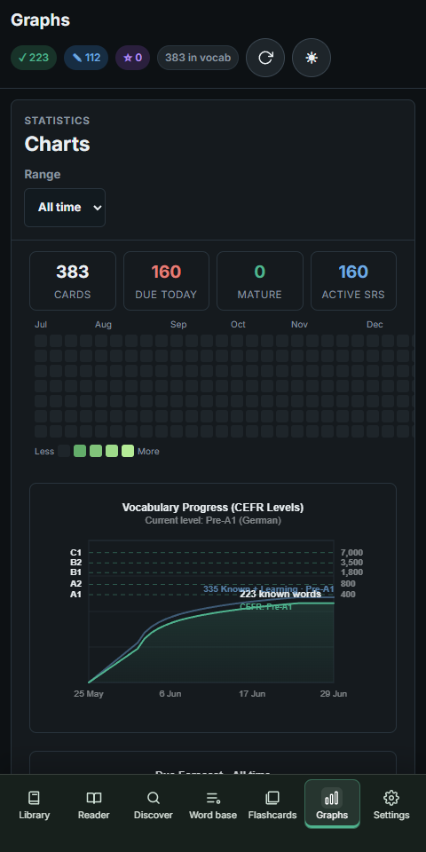

<p align="center">
  
</p>

<h1 align="center">Word Hunter</h1>

Word Hunter is a local-first reader, vocabulary trainer, and language-learning
workspace for desktop and Android. The Android version is called Word Hunter
Pocket.

The project is built around one idea: read real texts, click words you want to
learn, keep the context, and review them later without losing control of your
data.

## Project Status

Current release snapshot: `0.3.5`.

Active targets:

- Windows and Linux desktop: `Word Hunter`
- Android: `Word Hunter Pocket`

Installers, portable archives, APKs, and AABs are published as GitHub Release
assets, not tracked in the source tree.

## What It Includes

- Local-first reading for pasted text, PDFs, EPUB files, URLs, subtitles, and
  library imports.
- Vocabulary states, spaced-repetition review, TTS, keyboard shortcuts, and
  reading progress.
- OCR-assisted PDF reading for scanned documents on desktop builds.
- Translation and dictionary tools with language-aware handling for modern and
  historical languages.
- Android Pocket layout for mobile reading and review.
- Optional folder sync for library data, vocabulary, review state, and backups.

## Supported Learning Languages

Word Hunter keeps a separate library and vocabulary profile for each learning
language:

<table>
  <tr>
    <td> English</td>
    <td> German</td>
    <td> Spanish</td>
  </tr>
  <tr>
    <td> Italian</td>
    <td> French</td>
    <td> Polish</td>
  </tr>
  <tr>
    <td> Ukrainian</td>
    <td> Russian</td>
    <td> Japanese</td>
  </tr>
  <tr>
    <td> Chinese (Simplified)</td>
    <td> Latin</td>
    <td> Ancient Greek</td>
  </tr>
</table>

Translation, TTS, catalog, and offline-model availability can vary by language
and provider.

## Feature Walkthrough

### Library, Import, and OCR

The library collects imported texts, public-domain books, OCR/PDF entries, and
reading progress in one place. Desktop keeps the full import workflow visible,
including pasted text, ebooks, subtitles, and scanned PDF/OCR imports.



Word Hunter Pocket shows the same kind of library in a phone layout. Pocket is
optimized for reading and review on Android, with a compact card list, large
touch targets, collapsible search filters, and a side import drawer for lighter
mobile imports.



### Reader, Highlighting, and Word Panel

The reader highlights vocabulary by status directly in the text. Clicking a word
opens the word panel with status buttons, translation, notes, context, dictionary
actions, TTS, image hints, and in-text review controls.



Pocket keeps the same reading model, but changes the shape for mobile: bottom
navigation, touch selection, a compact toolbar, and a bottom sheet-style word
panel.



### Word Base

Every saved word keeps its status, translation, example sentence, review data,
and source context. The word base is the maintenance view for searching,
filtering, editing, exporting, and cleaning vocabulary.



### Flashcards and SRS

Flashcards use the same vocabulary records as the reader. Word Hunter supports
spaced repetition, due queues, review history, pronunciation, dictionary
actions, reverse cards, and rating buttons.



Pocket keeps flashcard review usable on a phone, with the card, answer controls,
review heatmap, and queue adapted to the narrow screen.



### Graphs and Progress

The graphs view turns vocabulary history into visible progress: total cards, due
reviews, mature cards, active review cards, heatmap activity, and vocabulary
growth levels.



The same progress view is available in Pocket, so review activity and vocabulary
growth remain visible away from the desktop.



### Desktop and Pocket Sync

Word Hunter is local-first. Desktop and Android can share custom texts, user
books, vocabulary, settings, progress, and imported reading materials through a
user-selected sync folder. The screenshots below show a shared demo library with
vocabulary progress rendered on desktop and Pocket.

| Desktop | Pocket |
| --- | --- |
|  |  |

Pocket intentionally keeps heavy import work lighter than desktop. Larger
conversion and OCR work is best done on desktop, then moved to Pocket through
sync.

## Sync and Backups

Word Hunter does not require an account or a central server. The app stores data
locally and can copy changes through a folder chosen by the user.

- Desktop can use a local data folder and an optional sync folder.
- Android keeps local data inside the app and lets the user pick a separate sync
  folder.
- Sync transfers books, vocabulary, settings, progress, and imported reading
  materials.
- Deleted books and words stay deleted after sync instead of returning from an
  older device copy.
- Cloud folders can be delayed. When using Google Drive or similar providers,
  use a dedicated Word Hunter folder and wait until cloud upload/download is
  complete before opening another device.
- Full backup export is useful before testing new sync setups.

## Supported Targets

- Windows desktop
- Linux desktop
- Android Pocket

macOS and iOS are not active targets right now.

## Build From Source

### Requirements

- Rust `1.88` or newer with Cargo.
- Tauri 2 native prerequisites for the desktop platform being built.
- PowerShell when using the bundled `build.bat` helper on Windows.
- Android SDK, NDK, and JDK for Android Pocket builds.
- OCR runtime/model assets only when preparing desktop OCR support.

### Common Commands

```powershell
.\build.bat test         # run shared, desktop, and Android frontend tests
.\build.bat installer    # build outputs\Word.Hunter.Setup.exe
.\build.bat portable     # build outputs\Word.Hunter.portable.zip
.\build.bat apk          # build outputs\Word.Hunter.Pocket.debug.apk
.\build.bat aab          # build outputs\Word.Hunter.Pocket.release.aab
.\build.bat play         # build signed Google Play AAB
.\build.bat ocr-runtime  # prepare bundled native PaddleOCR runtime
```

Rust backend tests can also be run directly:

```powershell
cargo test --manifest-path src-tauri\Cargo.toml
```

The build script writes distributable files to `outputs/`. That directory is
generated output, not source.

## Repository Layout

- `src/web/` - shared frontend application code.
- `src/web/platforms/` - platform-specific frontend styling and behavior.
- `src-tauri/` - Tauri 2 Rust backend, commands, OCR/import logic, and platform
  config.
- `src-tauri/platforms/android/` - Android-specific backend boundary.
- `frontend-tests/` - Node-based frontend and platform tests.
- `docs/` - public documentation and screenshots.
- `.cargo/` - Cargo configuration used by the workspace.
- `build.bat` - Windows convenience entrypoint for tests and release artifacts.

## Privacy and Data Ownership

Word Hunter is designed as a local-first app:

- No account is required.
- Books, custom texts, vocabulary, progress, and settings are stored locally.
- Sync uses a folder chosen by the user.
- Online requests happen only when the user uses features that need them, such
  as public catalog discovery, dictionary links, online translation, or online
  speech features.
- User data should be backed up before risky sync experiments or before moving
  data folders.

## License

Word Hunter is licensed under `AGPL-3.0-or-later`.

Closed-source commercial derivative use requires a separate written commercial
license. See `COMMERCIAL-LICENSE.md` for details.
